# Ema Fes Rowing

`Versão com fio atualizada em Janeiro de 2019
Elaborada por: Breno Ferreira`

---

##Modificações significativas

>Dispositivo com comunicação via cabo USB.
Movimentos podem ser selecionados em **oito** estados diferentes entre as combinações de Flexão **e/ou** Extensão **com/sem** canais auxiliares (**anexo tabela**).

##Nota importante
>Sempre verificar se está utilizando a ultima versão disponível no **GitHub**, pois o _Handle_ geralmente não encontra-se no Laboratório para a atualização do _firmware_ do **Arduino**.

---

## Softwares

Nesta versão, o funcionamento do dispositivo _Handle_ FES-Rowing é através de dois códigos, sendo:

1.	Em **Arduino** (`Rowing_Arduino.ino`) gravado no **Arduino NANO** embutido na barra do _Handle_ com acesso à sua Porta USB para atualização do _firmware_ (**IDE Arduino** instalado no Sistema Operacional (S.O.) do **Raspberry** para atualização de _firmware_).
1.	E **Python** rodando no S.O. do **Raspberry** com o _script_ `MainStim.py` e `stimulator.py` como função dependente (encontra-se na área de trabalho).

## Setup

O **Raspberry** pi necessita de uma fonte alimentadora (5V 2A e cabo micro USB)
As posições de ligação dos dispositivos nas portas USB não são específicas, o _script_ faz a checagem das Portas COM.
O **Arduino** é alimentado por um cabo USB conectado em qualquer porta USB do **Raspberry**. Necessita-se de um cabo longo para não limitar o movimento do _Handle_.
O Eletroestimulador é conectado a qualquer Porta USB do **Raspberry** e em modo _SCIENCE_. Apesar da flexibilidade de combinações de movimentos (Flexão e/ou Extensão com/sem canais auxiliares), os canais estão pré-definidos em _software_ da seguinte forma:

* Canal 1 e 2: Extensão
* Canal 3 e 4: Flexão
* Canal 5 e 6: Auxiliar Extensão
* Canal 7 e 8: Auxiliar Flexão

## Utilização
O _script_ em **Python** segue as seguintes etapas

### Etapa 01 – Conexão
São estabelecidas as conexões das portas COM do **Arduino** e estimulador com o **Raspberry**.
### Etapa 02 – Seleção dos Movimentos
É informado do _display_ o movimento desejado, e através dos botões direita e esquerda do _Handle_ alterna-se entre Flexão e/ou Extensão. O botão vermelho serve para selecionar o movimento indicado e passar para a próxima etapa.
### Etapa 03 – Seleção de Amplitude
É informado no _display_ o valor da amplitude de cada canal selecionado na etapa anterior. Utiliza-se o botão da direita para aumentar o valor e da esquerda para diminuir. O botão vermelho serve para selecionar a amplitude do canal indicado e passar para a próxima amplitude até acabar e passar para a próxima etapa.
### Etapa 04 – Seleção da Largura de pulso
É informado no _display_ o valor da Largura de pulso única para todos os canais selecionados. Utiliza-se o botão da direita para aumentar o valor e da esquerda para diminuir. O botão vermelho serve para selecionar a largura de pulso indicada e passar para a próxima etapa.

### Etapa 05 – Seleção da Frequência
É informado no _display_ o valor da Frequência única para todos os canais selecionados. Utiliza-se o botão da direita para aumentar o valor e da esquerda para diminuir. O botão vermelho serve para selecionar a frequência indicada e passar para a próxima etapa.

### Etapa 06 – Modo Run (Exercício)
Última etapa fica em _loop_ até ser reiniciado o _script_. Nesta etapa o botão direito realiza o movimento de Extensão com os grupos musculares escolhidos e alocados os eletrodos e o botão esquerdo o movimento de Flexão. O botão vermelho serve para parar o protocolo.

---

# Diagrama de maquinas de estado software

---
# Anexo

| CH 7,8 	| CH 5,6 	| CH 3,4 	| CH 1,2 	| MOVIMENTO(s)                                      	|
|:------:	|:------:	|:------:	|:------:	|---------------------------------------------------	|
|   00   	|   00   	|   00   	|   11   	| Extensão                                          	|
|   00   	|   00   	|   11   	|   00   	| Flexão                                            	|
|   00   	|   00   	|   11   	|   11   	| Estensão & Flexão                                 	|
|   00   	|   11   	|   00   	|   11   	| (Extensão + Aux. Extensão)                        	|
|   00   	|   11   	|   11   	|   11   	| (Extensão + Aux. Extensão) & Flexão               	|
|   11   	|   00   	|   11   	|   00   	| (Flexão + Aux. Flexão)                            	|
|   11   	|   00   	|   11   	|   11   	| Estensão & (Flexão + Aux. Flexão)                 	|
|   11   	|   11   	|   11   	|   11   	| (Extensão+Aux. Extensão) & (Flexão + Aux. Flexão) 	|
(* 1 para canal ativo e 0 canal inativo)
